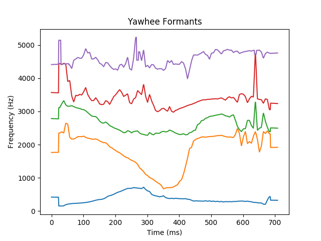

# formantsExtraction
This project allows you to extract each formants over time from arbitrary wave file (Python + Matlab).

The following code proposes a Python version and a Matlab version of formant extraction functions. It uses [parselmouth](https://github.com/YannickJadoul/Parselmouth) which is a cython version of Praat allowing to use any Praat function in a pythonic environment.

## Get Started
### Python
To install the dependencies for Python use (we assume the $python$ command is linking to your default python environement), you can use the following script:

    sh install_py.sh

### Matlab
To install the dependencies for Matlab use, you can use the following script:
    
    matlab install.m

## Functions
    
   * getFormants(filename (string) ): Returns the formants as a matrix (formants * time (ms))
   * getRangeFormants(filename (string), formant (int)): Returns the range (min, max) of a given formant.
   * getMeanFormants(filename (string), formant (int)): Returns the average frequency of a given formant.
    
Please refer to *main_formantsExtraction.m* and *main_formantsExtraction.py* for examples use of these functions.

## Examples

## Author

This code was realized by Guilhem Marion, PhD student at Laboratoire des Systèmes Perceptifs, ENS, Paris. The code can be used, modify and shared as long as a trace of the repository or name remains.
